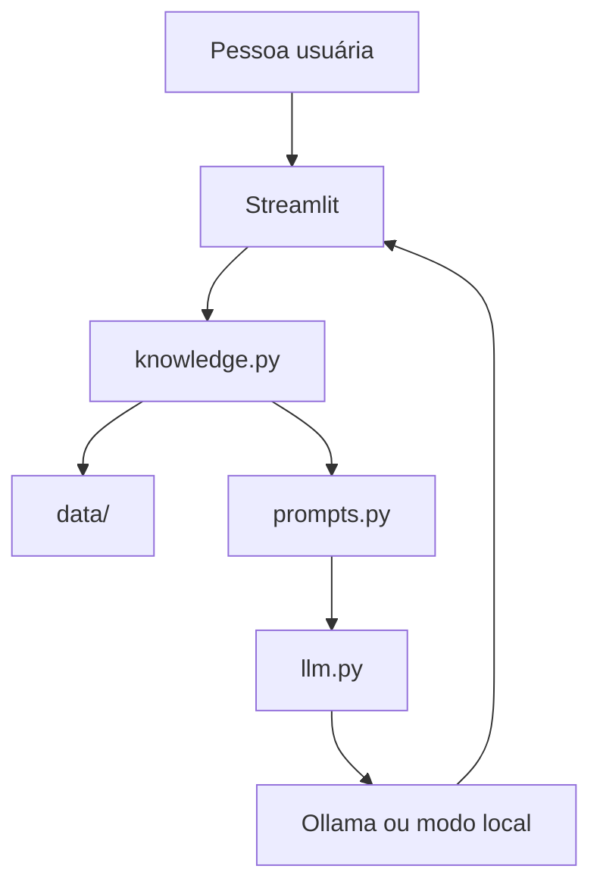

# Mira: Assistente Virtual de Organização Financeira

> Projeto prático da [DIO](https://www.dio.me/): assistente com IA generativa que ajuda a entender gastos, acompanhar a reserva de emergência e definir próximos passos financeiros com base em uma base de conhecimento estruturada.

**Lab:** Construa Seu Assistente Virtual Com Inteligência Artificial

---

## 1. O que é a Mira

A Mira é uma assistente de organização financeira pessoal. Ela conversa com a pessoa usuária, interpreta dúvidas e responde usando dados mockados de um cliente fictício (João Silva).

**O que faz:**

- Explica gastos e categorias do período
- Mostra progresso da reserva de emergência
- Esclarece conceitos financeiros (CDI, Selic, Tesouro Selic)
- Sugere próximos passos práticos

**O que não faz:**

- Não recomenda investimentos específicos
- Não acessa contas bancárias reais
- Não inventa informações fora da base
- Não substitui assessoria profissional

---

## 2. Os 6 passos do desafio

| Passo | Entrega | Arquivo |
|-------|---------|---------|
| 1. Documentação do agente | Caso de uso, persona, arquitetura, segurança | [`docs/01-documentacao-agente.md`](docs/01-documentacao-agente.md) |
| 2. Base de conhecimento | Dados mockados + glossário + estratégia de integração | [`docs/02-base-conhecimento.md`](docs/02-base-conhecimento.md) / [`data/`](data/) |
| 3. Prompts | System prompt, exemplos e edge cases | [`docs/03-prompts.md`](docs/03-prompts.md) / [`src/prompts.py`](src/prompts.py) |
| 4. Aplicação funcional | Chat Streamlit com LLM | [`src/app.py`](src/app.py) |
| 5. Avaliação e métricas | Cenários de teste e critérios | [`docs/04-metricas.md`](docs/04-metricas.md) / [`src/evaluate.py`](src/evaluate.py) |
| 6. Pitch | Roteiro de 3 minutos | [`docs/05-pitch.md`](docs/05-pitch.md) |

---

## 3. Arquitetura



**Stack:** Python, Streamlit, Pandas, Ollama (opcional)

---

## 4. Estrutura do repositório

```
assistente-virtual-ia/
├── README.md
├── requirements.txt
├── data/
│   ├── perfil_investidor.json
│   ├── transacoes.csv
│   ├── historico_atendimento.csv
│   ├── produtos_financeiros.json
│   └── glossario_financeiro.json
├── docs/
│   ├── 01-documentacao-agente.md
│   ├── 02-base-conhecimento.md
│   ├── 03-prompts.md
│   ├── 04-metricas.md
│   └── 05-pitch.md
├── src/
│   ├── app.py
│   ├── knowledge.py
│   ├── prompts.py
│   ├── llm.py
│   └── evaluate.py
└── web/
    ├── app/              # Interface Next.js (demo para pitch)
    ├── components/
    └── lib/
```

---

## 5. Como executar

### Instalar dependências

```bash
git clone https://github.com/cesarfavero/assistente-virtual-ia.git
cd assistente-virtual-ia
python3 -m venv .venv
source .venv/bin/activate
pip install -r requirements.txt
```

### Opção A: com Ollama (recomendado)

```bash
# Instalar em https://ollama.com
ollama pull llama3.2
ollama serve

cd src
streamlit run app.py
```

### Opção B: modo demonstração (sem Ollama)

```bash
cd src
streamlit run app.py
```

Se o Ollama não estiver rodando, a Mira usa respostas baseadas em regras e na base de conhecimento.

### Avaliação automatizada

```bash
cd src
python evaluate.py
```

### Interface web (demo para pitch e Vercel)

```bash
cd web
npm install
npm run dev
```

Abra http://localhost:3000. Chat estilo assistente moderno, com a mesma lógica da Mira.

**Deploy Vercel:** conecte o repositório e defina `Root Directory` como `web` (ou use o `vercel.json` na raiz).

---

## Pitch (vídeo 3 min)

| Tempo | Bloco |
|-------|-------|
| 0:00-0:30 | Problema |
| 0:30-1:30 | Solução |
| 1:30-2:30 | Demonstração (gravar a `web/`) |
| 2:30-3:00 | Diferencial e impacto |

Link do vídeo: [inserir em `docs/05-pitch.md` após gravar]

---

## 6. Exemplos de uso

**Pergunta:** "Quanto gastei com alimentação?"

**Mira:** Responde R$ 570,00 com base em `transacoes.csv` e sugere comparar com o orçamento planejado.

**Pergunta:** "Como está minha reserva de emergência?"

**Mira:** Informa R$ 10.000,00 de R$ 15.000,00 (meta) e sugere um plano de aportes.

**Pergunta:** "Onde devo investir?"

**Mira:** Explica que não recomenda investimentos, mas pode explicar produtos compatíveis com o perfil.

---

## 7. Métricas de avaliação

| Métrica | Objetivo |
|---------|----------|
| Assertividade | Responder corretamente o que foi perguntado |
| Segurança | Não inventar dados fora da base |
| Coerência | Respostas adequadas ao perfil do cliente |

Resultado dos testes estruturados (modo local): **6/6 cenários aprovados**.

---

## 8. Referências

- Repositório base DIO: [dio-lab-bia-do-futuro](https://github.com/digitalinnovationone/dio-lab-bia-do-futuro)
- Exemplo de referência: [Edu, Educador Financeiro](https://github.com/falvojr/dio-lab-bia-do-futuro)
- [Streamlit](https://streamlit.io/) | [Ollama](https://ollama.com/)

---

**Autor:** Cesar Favero  
**Plataforma:** [DIO](https://www.dio.me/)  
**Data:** Junho/2026