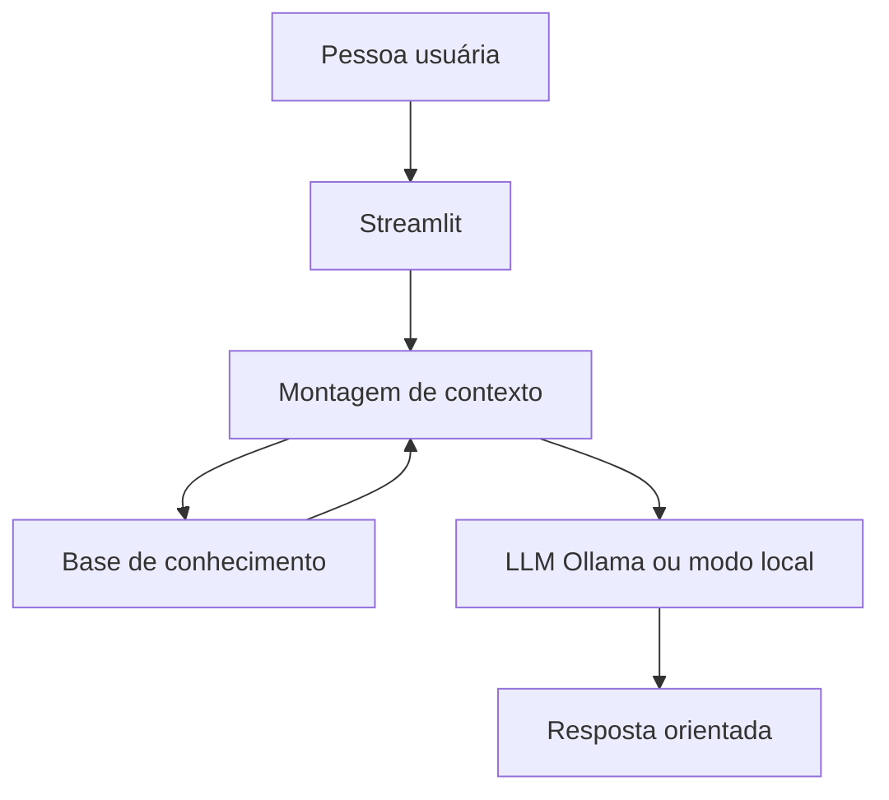

# Documentação do Agente

## Caso de Uso

### Problema

Muitas pessoas querem organizar as finanças, mas não sabem por onde começar: não entendem para onde vai o dinheiro, se a reserva de emergência está adequada ou qual deve ser o próximo passo prático.

### Solução

A **Mira** é uma assistente de organização financeira pessoal que conversa com a pessoa usuária, interpreta dúvidas e responde com base em uma base de conhecimento estruturada (perfil, transações, metas, produtos e glossário).

Ela não substitui um consultor certificado. O foco é orientar, explicar e sugerir próximos passos concretos.

### Público-alvo

Pessoas iniciantes em finanças pessoais que precisam de apoio para entender gastos, acompanhar metas e tomar decisões com mais clareza.

---

## Persona e Tom de Voz

### Nome do Agente

Mira

### Personalidade

- Acolhedora e objetiva
- Explica com exemplos do próprio contexto do cliente
- Não julga hábitos de consumo
- Admite limitações quando falta informação

### Tom de Comunicação

Informal e acessível, como uma conversa com alguém que entende do assunto e quer ajudar a organizar.

### Exemplos de Linguagem

- Saudação: "Oi! Sou a Mira. Posso te ajudar a entender seus gastos, sua reserva ou seus próximos passos."
- Confirmação: "Pelos seus dados de outubro, sua maior despesa é moradia."
- Limitação: "Não tenho essa informação na base, mas posso te ajudar com o que está disponível."

---

## Arquitetura

### Diagrama

### Componentes

| Componente | Descrição |
|------------|-----------|
| Interface | Streamlit (`src/app.py`) |
| Base de conhecimento | JSON/CSV em `data/` |
| Contexto | Resumo calculado em `src/knowledge.py` |
| LLM | Ollama (preferencial) ou fallback local em `src/llm.py` |
| Prompts | `src/prompts.py` |

---

## Segurança e Anti-alucinação

### Estratégias adotadas

- [x] Contexto montado a partir dos arquivos em `data/`
- [x] Resumo de gastos calculado por código (não pela IA)
- [x] Regra explícita de não inventar informações no system prompt
- [x] Recusa de temas fora de finanças pessoais
- [x] Sem coleta de senhas ou dados sensíveis

### Limitações declaradas

- Não recomenda investimentos específicos
- Não acessa contas bancárias reais (usa dados mockados)
- Não substitui assessoria profissional certificada
- Não fornece cotações de mercado em tempo real